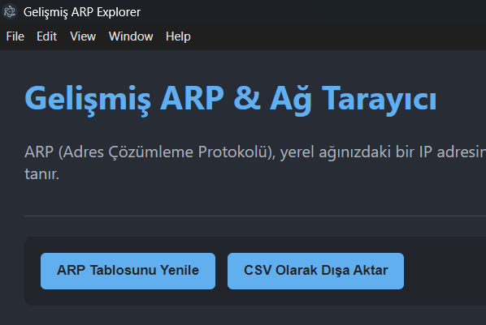

# Electron ARP & Network Explorer

<p align="center">
  <strong>Bir Electron ve React uygulaması ile yerel ağınızı keşfedin ve ARP tablosunu görüntüleyin.</strong><br>
  <em>Discover your local network and view the ARP table with an Electron and React application.</em>
</p>

<p align="center">
  
  
  
</p>

---

### Dil / Language

[**🇬🇧 English**](#-english) | [**🇹🇷 Türkçe**](#-türkçe)

---

<!-- EKRAN GÖRÜNTÜSÜ BÖLÜMÜ -->
<p align="center">
  <em>Uygulamanın ekran görüntüsünü buraya ekleyin. Proje dizininde `assets/screenshot.png` oluşturun.</em><br>
  <em>Add a screenshot of the application here. Create `assets/screenshot.png` in the project directory.</em><br><br>
  
</p>

---

## <a id="english"></a>🇬🇧 English

<details open>
<summary><strong>Click to expand/collapse the English section</strong></summary>

### ► About The Project

This project is a cross-platform desktop application developed with **Electron** and **React (Vite)**. It allows you to view your operating system's ARP (Address Resolution Protocol) table and actively scan your local network to discover connected devices.

It serves as a great example for understanding:
*   How Electron's main and renderer processes communicate (`ipcMain`, `ipcRenderer`, `contextBridge`).
*   Running background system commands (`arp -a`, `ping`) from a Node.js environment.
*   Building a modern user interface with React for a desktop application.
*   Live data updates from the main process to the renderer process.

### ► Features

*   **View ARP Table:** Fetches and displays the ARP table (IP Address, MAC Address, Type) from the underlying OS.
*   **Cross-Platform:** Works on Windows, macOS, and Linux thanks to platform-specific commands.
*   **Network Scan (Ping Sweep):** Actively scans a user-defined IP range on the local network to find live hosts.
*   **Live Scan Progress:** Shows real-time updates in the log as each IP address is being scanned.
*   **Export to CSV:** Allows exporting the current ARP table to a `.csv` file.
*   **Modern UI:** A clean, dark-themed, and responsive user interface built with React.

### ► Tech Stack

*   **[Electron](https://www.electronjs.org/):** Framework for creating native applications with web technologies.
*   **[React](https://reactjs.org/):** A JavaScript library for building user interfaces.
*   **[Vite](https://vitejs.dev/):** A fast frontend build tool for modern web projects.
*   **[Node.js](https://nodejs.org/):** Used in the main process to execute system commands.
*   **[ping](https://www.npmjs.com/package/ping):** A Node.js module for network ping operations.

### ► Getting Started

To get a local copy up and running, follow these simple steps.

#### Prerequisites

*   [Node.js](https://nodejs.org/) (LTS version recommended)
*   NPM (comes with Node.js)

#### Installation & Setup

1.  **Clone the repository:**
    ```sh
    git clone https://github.com/your-username/electron-arp-explorer.git
    ```

2.  **Navigate to the project directory:**
    ```sh
    cd electron-arp-explorer
    ```

3.  **Install NPM packages:**
    ```sh
    npm install
    ```

### ► Usage

#### Running in Development Mode

To run the app with hot-reloading for both the React UI and the Electron main process:

```sh
npm run dev
```

This will start the Vite development server and the Electron application simultaneously.

#### Building for Production

To build the application into a distributable executable file (e.g., `.exe`, `.dmg`):

```sh
npm run build
```

The output files will be located in the `release` directory.

### ► Project Structure

```
electron-arp-explorer/
├── dist/               # Build output for the React app
├── main.js             # Electron main (Node.js) process
├── preload.js          # Context bridge for secure IPC
├── vite.config.js      # Vite configuration file
├── package.json
└── src/
    ├── renderer/       # React application source code
    │   ├── App.jsx
    │   ├── App.css
    │   ├── index.html
    │   └── index.jsx
    └── services/
        └── arpService.js # Functions for ARP/ping logic
```
<br/>
</details>

---

## <a id="türkçe"></a>🇹🇷 Türkçe

<details>
<summary><strong>Türkçe bölümünü görmek için tıklayın</strong></summary>

### ► Proje Hakkında

Bu proje, **Electron** ve **React (Vite)** ile geliştirilmiş, çapraz platform bir masaüstü uygulamasıdır. İşletim sisteminizin ARP (Adres Çözümleme Protokolü) tablosunu görüntülemenize ve yerel ağınızı aktif olarak tarayarak bağlı cihazları keşfetmenize olanak tanır.

Bu proje, aşağıdaki konuları anlamak için harika bir örnektir:
*   Electron'un ana (main) ve renderer süreçlerinin nasıl iletişim kurduğu (`ipcMain`, `ipcRenderer`, `contextBridge`).
*   Node.js ortamından arka planda sistem komutlarının (`arp -a`, `ping`) nasıl çalıştırıldığı.
*   Bir masaüstü uygulaması için React ile modern bir kullanıcı arayüzünün nasıl oluşturulduğu.
*   Ana süreçten renderer sürecine canlı veri akışının nasıl sağlandığı.

### ► Özellikler

*   **ARP Tablosunu Görüntüleme:** İşletim sisteminden ARP tablosunu (IP Adresi, MAC Adresi, Tür) çeker ve görüntüler.
*   **Çapraz Platform:** Platforma özel komutlar sayesinde Windows, macOS ve Linux üzerinde çalışır.
*   **Ağ Taraması (Ping Sweep):** Yerel ağda kullanıcı tarafından belirlenen bir IP aralığını aktif olarak tarayarak canlı cihazları bulur.
*   **Canlı Tarama İlerlemesi:** Her bir IP adresi taranırken log bölümünde anlık güncellemeler gösterir.
*   **CSV'ye Aktarma:** Mevcut ARP tablosunu `.csv` dosyası olarak dışa aktarmaya olanak tanır.
*   **Modern Arayüz:** React ile oluşturulmuş temiz, koyu temalı ve duyarlı bir kullanıcı arayüzü.

### ► Kullanılan Teknolojiler

*   **[Electron](https://www.electronjs.org/):** Web teknolojileriyle native uygulamalar oluşturmak için bir framework.
*   **[React](https://reactjs.org/):** Kullanıcı arayüzleri oluşturmak için bir JavaScript kütüphanesi.
*   **[Vite](https://vitejs.dev/):** Modern web projeleri için hızlı bir ön yüz geliştirme aracı.
*   **[Node.js](https://nodejs.org/):** Ana süreçte sistem komutlarını çalıştırmak için kullanılır.
*   **[ping](https://www.npmjs.com/package/ping):** Ağ ping işlemleri için bir Node.js modülü.

### ► Başlarken

Projeyi yerel makinenizde çalıştırmak için aşağıdaki basit adımları izleyin.

#### Ön Gereksinimler

*   [Node.js](https://nodejs.org/) (LTS sürümü tavsiye edilir)
*   NPM (Node.js ile birlikte gelir)

#### Kurulum

1.  **Projeyi klonlayın:**
    ```sh
    git clone https://github.com/kullanici-adiniz/electron-arp-explorer.git
    ```

2.  **Proje dizinine gidin:**
    ```sh
    cd electron-arp-explorer
    ```

3.  **NPM paketlerini yükleyin:**
    ```sh
    npm install
    ```

### ► Kullanım

#### Geliştirme Modunda Çalıştırma

Uygulamayı hem React arayüzü hem de Electron ana süreci için anlık yenileme (hot-reloading) özelliğiyle çalıştırmak için:

```sh
npm run dev
```

Bu komut, Vite geliştirme sunucusunu ve Electron uygulamasını eş zamanlı olarak başlatacaktır.

#### Production için Build Alma

Uygulamayı dağıtılabilir bir çalıştırılabilir dosyaya (`.exe`, `.dmg` gibi) dönüştürmek için:

```sh
npm run build
```

Çıktı dosyaları `release` klasöründe oluşturulacaktır.

### ► Proje Yapısı

```
electron-arp-explorer/
├── dist/               # React uygulamasının build çıktısı
├── main.js             # Electron ana (Node.js) süreci
├── preload.js          # Güvenli IPC için köprü dosyası
├── vite.config.js      # Vite yapılandırma dosyası
├── package.json
└── src/
    ├── renderer/       # React uygulama kaynak kodları
    │   ├── App.jsx
    │   ├── App.css
    │   ├── index.html
    │   └── index.jsx
    └── services/
        └── arpService.js # ARP/ping mantığını içeren fonksiyonlar
```
<br/>
</details>

---

Bu proje MIT Lisansı ile lisanslanmıştır. Daha fazla bilgi için `LICENSE` dosyasına bakın.
